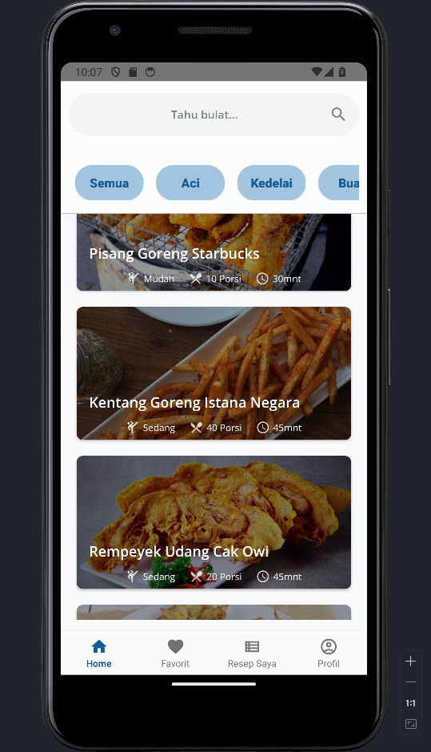

# Gorengan Indonesia
     

Simple Android App that provides numerous recipes of Indonesian fritters. This project is done to fulfill College Subject (Mobile Programming) Final Assignment. [Backend](https://github.com/asrofilfachrulr/API-Gorengan-Indonesia) of the app is hosted as Express.js serverless app on PaaS Vercel and use Database Hosting (configured) also Storage Hosting (planned) at Supabase.

## Snapshot

## Features
- [x] User Account *(partially)*
- [ ] CRUD Receipt(s) by Logged Users *(only read for now)*
- [ ] CRUD Rating Receipt by Logged Users
- [x] Share Receipt (currently limited to plain text)
- [ ] Save Receipt(s) Offline
- [x] Mark Favourite Receipt
- [x] Filter List Data with Search Keyword

## TODO
~~1. change layout on detail activity: move kebab menu to the right of reciept title then replace the its place before with toggle add favourite button~~  

~~2. add author name on detail, main also put small profile thumb~~  

~~3. convert necessary toast to has short period~~  

~~4. add logged user data to global model data which use account model~~  

~~5. implement myrecipe fragment~~  

~~6. implement profile fragment (at least the layout + logout)~~  

~~7. implement rating activity (at least the layout + dummy data (optional))~~  

~~8. ensure to reset scroll every changing category or tab~~  

~~9. redesign category tabs so only active tab has solid color~~  

~~10. implement new recipe layout~~  

~~11. implement api request on get recipes~~  

~~12. implement api request on detail recipes (ingredients and steps)~~  

~~13. use image from remote storage file~~   

~~14. generate rating dummy data on db~~

~~15. implement api request on get ratings~~

~~16. implement sort and filter on rating page~~

17. persist favourite recipes on db through api request
18. delete favourite recipes on db through api request
19. share via whatsapp using image and text
20. implement logic on creating recipe
21. persist created recipe on db through api request
22. delete owned recipe through api request
23. update owned recipe through api request
24. implement logic on adding rating
25. persist added rating through api request
26. delete owned rating through api request
27. implement logic on add like on a rating
28. persist added like on a rating on db through api request
29. implement logic on displaying bars rating each star
30. implement layout account setting
31. implement what user do on account setting
32. do the CRUD 
... 

-1. implement the sytle from figma
